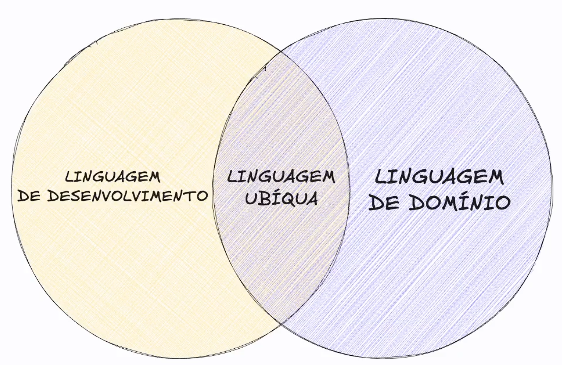
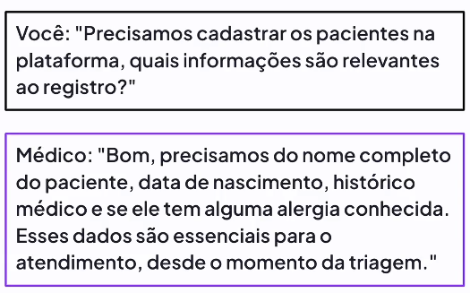
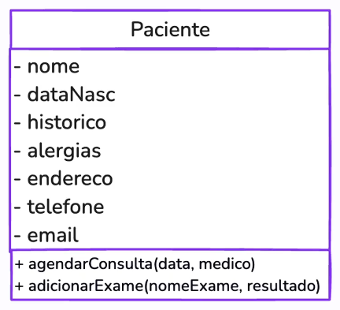
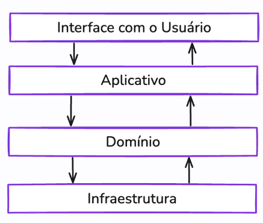
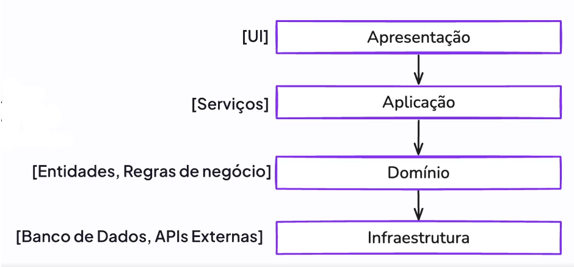
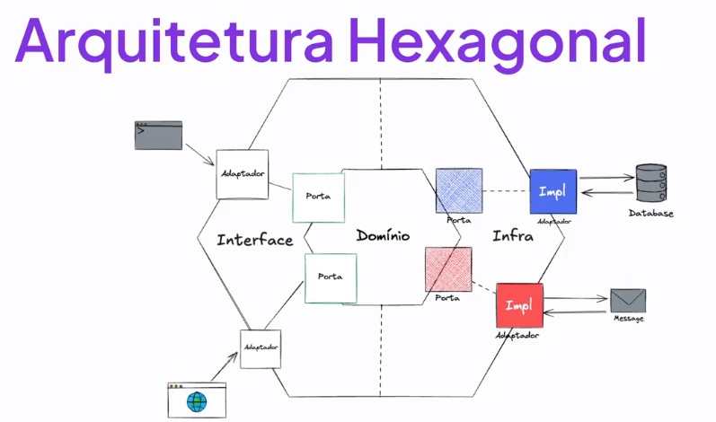

[⬅️Voltar](../readme.md)

# Conceitos Fundamentais

---

## Comunicação Eficiente

- idioma == idioma

- linguagem != linguagem

**Resultado:**

## Domínio

- "Coração do software"

- Núcle do sistema
  - Regras de negócio
  - Lógica central da aplicação

- Arquitetura de Software:
  - Estrutura organizacional
  - Interpretação de componentes
  - Permite que o domínio seja estruturalmente isolado
  - 

---

## Arquitetura em Camadas

#### Apresentação [UI]:

- Frontend, terminal, etc.

- Coleta dados e os envia para a **Camada de Aplicação**

- Camada em que o usuário interage **(Inputs)**

>

#### Aplicação [Serviços]:

- Orquestração de operações

- Métodos

- Validações (CPF, email, celular, ect.)

- **Gatilho** para execução das regras de negócio da camada de domínio

- Depende da camada de **Domínio**

>

#### Domínio [Entidades, Regras de negócio]:

- **Lógica central** do programa

- Independente de detalhes técnicos

- Foco único no **Negócio**

>

#### Infraestutura [Banco de Dados, APIs Externas] :

- Detalhes técnicos

- Conexão com Banco de dados e APIs

- Conexão com serviço de pagamento, etc.

## Benefícios da Arquitetura em Camadas

- Isolamento do **Domínio**

- Clareza

- Testabilidade

- Escabilidade

- Reúso

- Boa para projetos de **PEQUENO E MÉDIO PORTE**
  - **PODE SE TORNAR DIFÍCIL DE MANTER EM PROJETOS MAIORES**

---

## Arquitetura Hexagonal

- **Portas e adaptadores** se conectam ao **Domínio**

#### Portas:

1. Portas de entrada (**Primary**)

2. Portas de saída (**Secondary**)

- Definem como o domínio pode ser **acessado**

- Determinam como uma ação vai ser feita

#### Adaptadores:

1. Adaptador **Primário**
   - Interface

2. Adaptador **Secundário**
   - Infraestrutura

- Implementações concretas das portas

- Repositório

- Facilita por exemplo a troca de banco de dados, pois será necessário fazer alterações **APENAS** nos adaptadores (pois o domínio está completamente isolado)

## Benefícios da Arquitetura Hexagonal

- Isolamento **TOTAL** do **Domínio**

- Portas / Adaptadores

- Testabilidade

- Flexibilidade

- Reúso

- Boa para projetos de **GRANDE PORTE**
  - **PODE SE TORNAR DIFÍCIL DE USAR EM PROJETOS MENORES**

[Próximo ➡️](03-entidades-e-objetos-de-valor.md)
