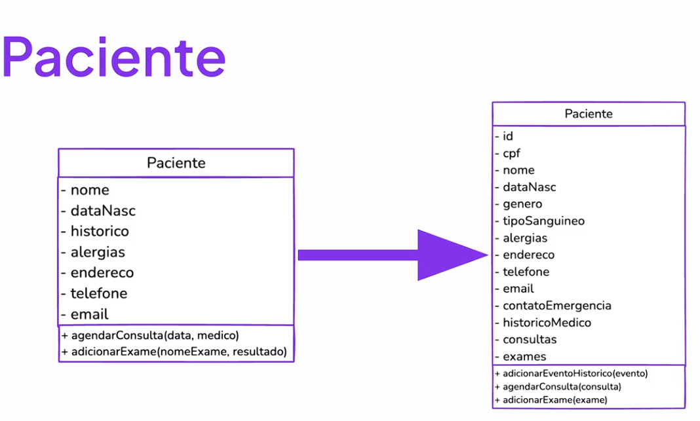
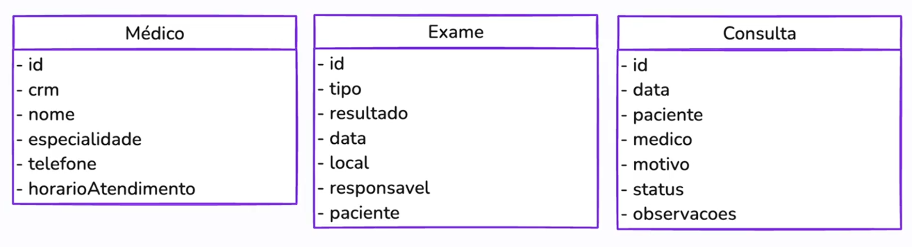
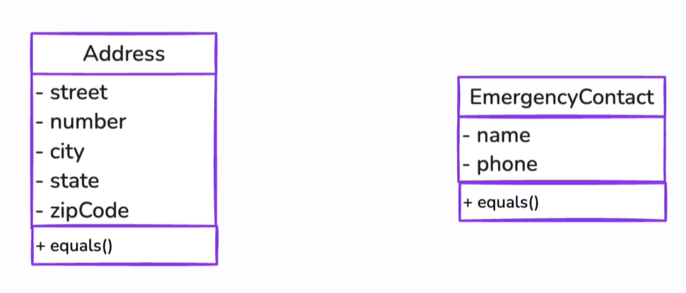
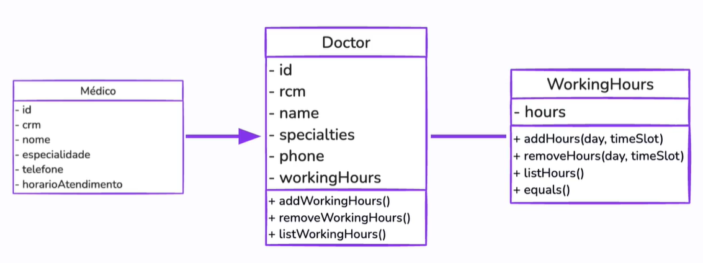

# Entidades e Objetos de Valor

---

### Elementos do Modelo:

1. **Entidades**
   
   - Objetos com identidade única
   - Geralmente tem ID único

2. **Objetos de Valor**
   
   - Objetos **importantes** para o sistema
   - Ex: "Endereço"

3. **Agregados**
   
   - **Blocos de código** que relacionam **Objetos de valor** com **Entidades**
   - Ex: Paciente ➡️ Histórico de consultas

4. **Serviços do Domínio**
   
   - Determinam operações que não pertencem a entidades específicas

5. **Repositórios**
   
   - Entidades utilizadas para **persistier** e **recuperar** entidades do **Banco de Dados**

---

## Entidades

**Características**:

- Identidade (única)

- Ciclo de Vida

- Comportamento
  
  - Regra de negócio

**Como identificar entidades?**

- Entender o domínio

- Buscar características únicas

- Analisar o ciclo de vida

- Definição do comportamento

**Exemplos de entidades:**

1. Paciente

2. Médico

3. Consulta

4. Exame

5. Prontuário

**Entidade Paciente Refatorado:**

**Demais entidades:**

## Objetos de Valor

- Não possuem ID (identidade unica)

- Imutáveis

**Como identificá-los?**:

- Buscar elementos sem ID

- Analisar atributos

- Verificar imutabilidade

**Exemplos de Objetos de Valor**

- Endereço

- Contato de Emergência

- Horário de Atendimento

