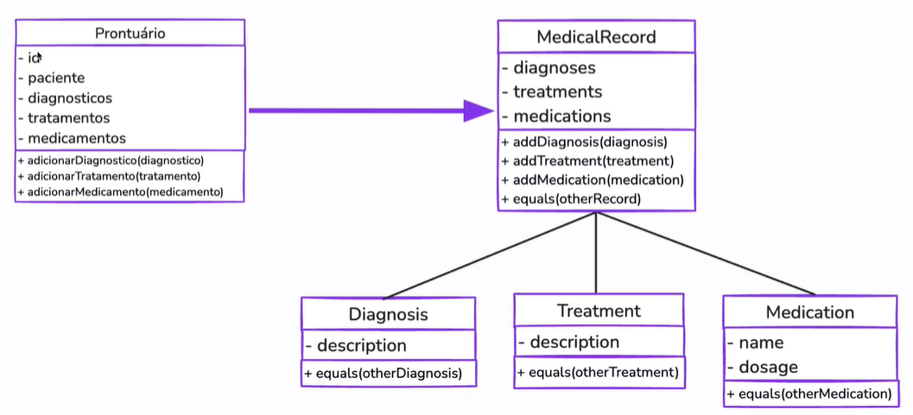
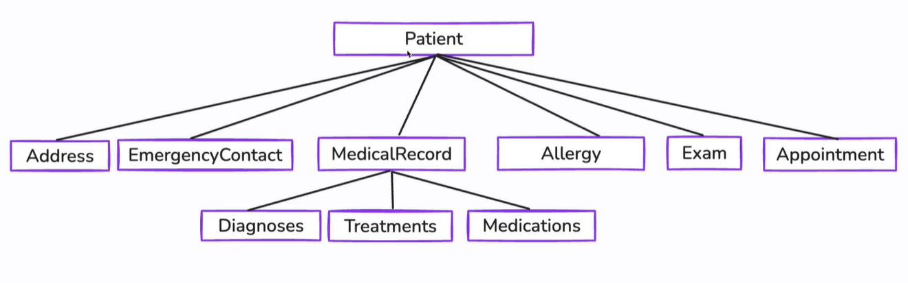
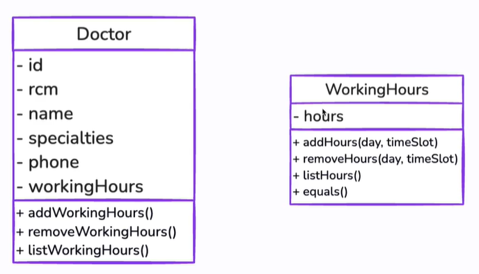
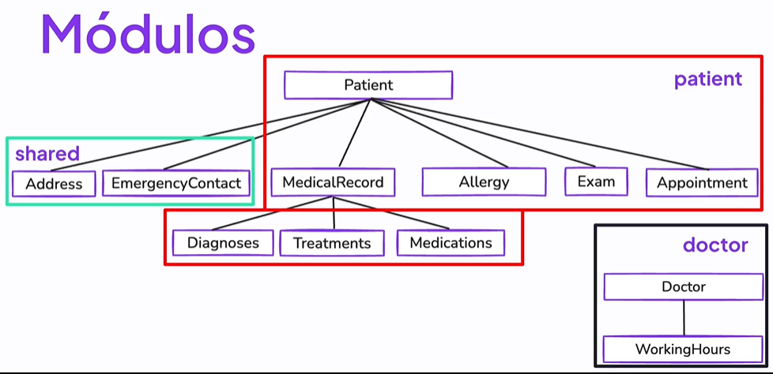

[⬅️Voltar](./03-entidades-e-objetos-de-valor.md)

# Agregados

---

#### O que são?

- Grupo de **entidades** e **objetos** que são tratados como uma **UNIDADE**

- Compostos por:
  1. Raiz do Agregado
     - Controla o **acesso** ao agregado

  2. Entidades e Objetos de Valor

- As **regras de negócio** ficam contidas no escopo do **agregado**

#### Qual é a utilidade?

- Mantém a consistência (regras de negócio)

- Simplifica o acesso

- Melhora o desempenho

#### Possíveis Agragados:

- Paciente

- Médico

**Agregado Paciente:**

**Agregado Médico:**

#### Módulos:

- Unidades que agrupam código relacionados

- Organizam o código

- Promovem reutilização

- Falicitam a manutenção

[Próximo ➡️](./05-repositorios-e-servicos.md)
