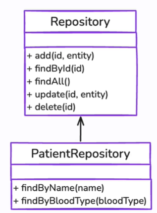

# Repositórios e Serviços

_Elementos do Modelo_

---

## Repositórios:

- Encapsula como os dados são **acessados**

- **CRUD**

- Gerenciar **agregados**, garantindo consistência

---

## Serviços

- Encapsulam a lógica do negócio

- Não pertencem a uma entidade ou objeto de valor

#### São usados para:

- Operações que envolvem múltiplas entidades

- Implementação de regras complexas

- Coordenação de operadores (comunicação entre objetos)
1. **Serviços de Aplicação**

2. **Serviços de Domínio**

3. **Serviços de Infraestrutura**
